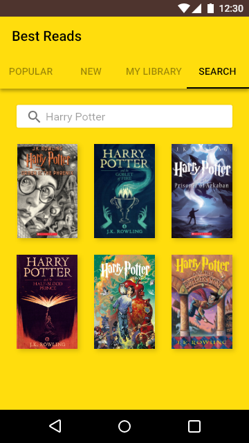

# ANBD | BookListingApp
The goal is to design and create the structure of a Book Listing app which would allow a user to get a list of published books on a given topic. The list of books will be provided via Google Books API in order to fetch results and display them to the user. 
Project book listing. This is the seventh project completed for the Android Basics Nanodegree program offered by Udacity in collaboration with Google. 
This is a proposed design for the Android app.

 

# Pre-requisites
Android SDK v22 Android Build Tools v22.0.1 Android Support Repository v22.1.1

# Learning objectives
This project is about combining various ideas and skills we’ve been practicing throughout the course. They include:

- Fetching data from an API
- Using an AsyncTask
- Parsing a JSON response
- Creating a list based on that data and displaying it to the user.
